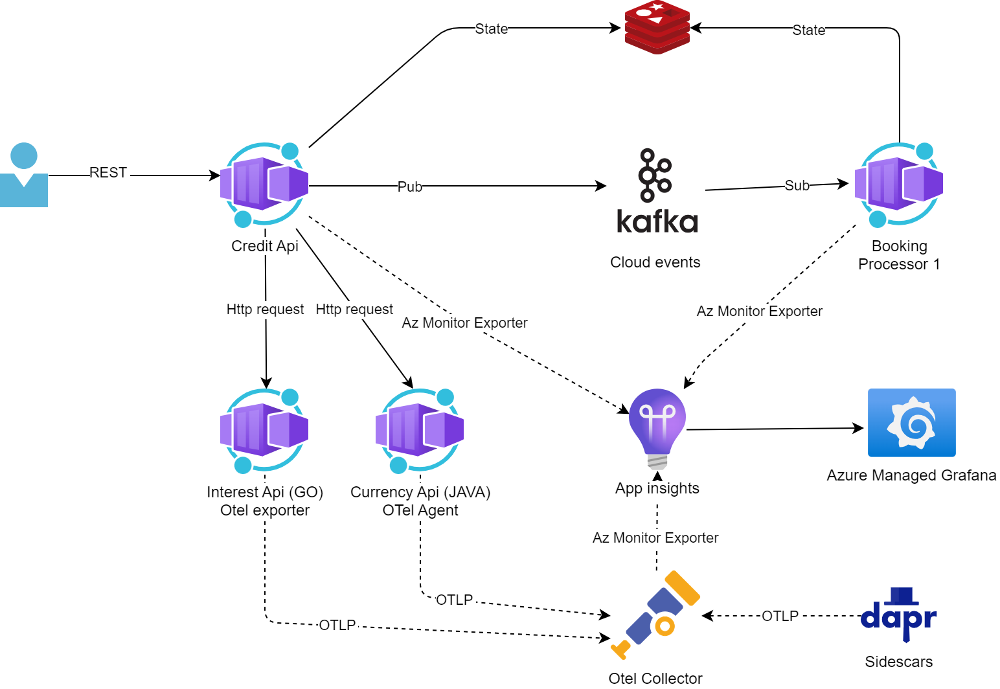

# Deploy to Kubernetes 

This is the kubernetes version of the deployment. Bring your own cluster or deploy a AKS cluster in Azure first.
Requirements for kubernetes deploy:
* Helm v3
* Kubectl

The monitoring setup for the internal testing setup.




## Using and deploying AKS
This deploy requires owner access on subscription and the rights to create service principals in the Azure Active Directory. 

Requirements:
* Azure Cli
* Azure subscription with owner access

First create an resource group (change location and name if you wish):
```cmd
az group create -l northeurope -n rg-aks-dapr-demo
```

Deploy the Container Registry. Choose a unique name for the name parameter (only text without special signs and space, some resources are global unique and will create a uri)

```cmd
az deployment group create -g rg-aks-dapr-demo --template-file aks-registry.bicep --parameters name=<Your name>
```

Deploy the AKS cluster. 

```cmd
az deployment group create -g rg-aks-dapr-demo --template-file aks.bicep --parameters name=<Your name>
```

## Deploying extensions to Kubernetes

This the guid how to install the required extensions to kubernetes

Connect to your kubeneters cluster.

Install KEDA. **Omit the aks-values.yaml if you don´t want AKS specific configuration**

```cmd
helm repo add kedacore https://kedacore.github.io/charts
helm repo update

kubectl create namespace keda
helm install keda kedacore/keda --namespace keda -f helm/Keda/aks-values.yaml
```

Install Dapr. **Omit the aks-values.yaml if you don´t want AKS specific configuration**

**This can also be installed by using the dapr extension for AKS. Use the bicep file ```aks-extension.bicep``` to deploy the extension.**

```cmd
helm repo add dapr https://dapr.github.io/helm-charts/
helm repo update

kubectl create namespace dapr-system
helm install dapr dapr/dapr --namespace dapr-system -f helm/Dapr/aks-values.yaml
```

Install Nginx Ingress controller. **Omit the aks-values.yaml if you don´t want AKS specific configuration**

```cmd
helm repo add ingress-nginx https://kubernetes.github.io/ingress-nginx
helm repo update

kubectl create namespace ingress
helm install ingress-nginx ingress-nginx/ingress-nginx --namespace ingress -f helm/nginx/aks-values.yaml
```

Install ArgoCD controller. **Omit the aks-values.yaml if you don´t want AKS specific configuration**

```cmd
helm repo add argo https://argoproj.github.io/argo-helm
helm repo update

kubectl create namespace argocd
helm install argocd argo/argo-cd --namespace argocd -f helm/ArgoCD/aks-values.yaml
```

# Deploy the infrastructure

This section contains the guide to install the application specific infrastructure.

## Deploy the Dapr components for AKS and Azure

Create a namespace for the application

```cmd
kubectl create namespace credits
```

**Modify the ```deployments/dapr-components-azure.yaml``` file to point to your Azure components.**
After that, install the Dapr components for the application

```cmd
kubectl apply -f deployments/dapr-components-azure.yaml
```

## Deploy the infrastructure for internal testing (Not for production scenarios)

Create a namespace for the application

```cmd
kubectl create namespace credits
```

Install internal testing infrastructure (Redis + Kafka). Same as docker compose.
```cmd
helm repo add bitnami https://charts.bitnami.com/bitnami
helm repo update

helm install kafka bitnami/kafka --namespace credits -f helm/Kafka/bitnami-testing-values.yaml
kubectl apply -f testing/redis.yaml
kubectl apply -f testing/kafdrop.yaml
```

Deploy the dapr components that uses (Redis + Kafka)

```cmd
kubectl apply -f testing/dapr-components-internal.yaml
```

## Deploy the OpenTelemetry Collector for Dapr and the application

Uses the namespace ```credits``` created in the previous section.

```cmd
kubectl apply -f monitoring/otel-collector-dapr.yaml
```


# Deploy the application

Uses the namespace ```credits``` created in the previous section.

Deploy the application to Azure Container Registry. Se the [ReadMe.md](../../README.md#build-and-publish-the-containers-to-azure-container-registry) in the root of the repository for more information.

## Install the application

First choose the setting you want to deploy. This is done by deploying the correct secrets file.
```cmd
kubectl apply -f deployments/with-appinsights.yaml
or
kubectl apply -f deployments/with-otel-collector.yaml
or
kubectl apply -f deployments/with-otel-collector-ds.yaml
```

Replace the container registry image uri ```<registry>``` in ```deployments/credit-api.yaml``` and ```deployments/booking-processor.yaml``` to point to your registry. 

Then install the application deployments

```cmd 
kubectl apply -f deployments/credit-api.yaml
kubectl apply -f deployments/booking-processor.yaml
```

## Install the KEDA Scaler

To be able to auto scale the booking-processor based on the processing lag we use KEDA to scale the application.

### For Azure Event Hub

**Modify the ```deployments/eventhub-scaler.yaml``` file to point to your Azure components.**

```cmd
kubectl apply -f deployments/eventhub-scaler.yaml
```

### For Kafka (Internal Testing)

```cmd
kubectl apply -f testing/kafka-scaler.yaml
```